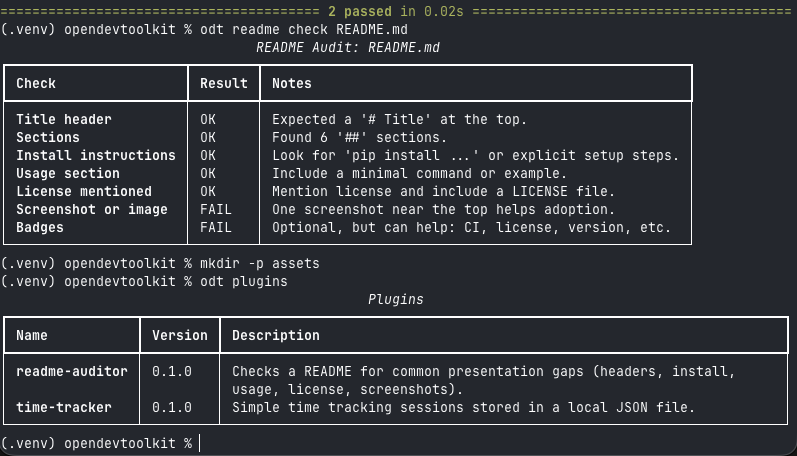

# OpenDevToolkit


<p align="center">
  
</p>

<p align="center">
  
</p>

OpenDevToolkit is a small command line tool that groups a few practical developer utilities under one executable.  
It is meant for personal use, small projects, and simple automation, not for replacing full platforms or services.

Everything runs locally. Nothing is auto-detected, synced, or uploaded anywhere.

## Install

This is a local install meant for development or personal use.

```bash
python -m venv .venv
source .venv/bin/activate
pip install -U pip
pip install -e .
```

After installing, confirm it is working:

```bash
odt --help
odt plugins
```

## Usage

The main command is `odt`. Each tool is exposed as a subcommand.

```bash
odt --help
odt plugins
```

### README auditor

This tool checks a README file for common issues that make repositories harder to understand or adopt.

```bash
odt readme check README.md
```

It looks for things like a title, install steps, usage examples, and license mentions.  
If checks fail, the command exits with a non-zero status so it can be used in CI.

### Time tracker

This is a very simple time tracker that stores data locally in JSON.

```bash
odt time start "my-project"
odt time status
odt time stop
odt time report --days 7
odt time export --out time.json
```

There is no account system and no syncing. Project names are just strings.

## Data storage

By default, state is written to a per-user data directory on the machine.

If you want to control where data is stored, you can override it:

```bash
odt --data-dir ./_odt_data time status
```

## Plugins

Tools are implemented as plugins discovered through Python entry points.  
Each plugin registers its own subcommands and does not depend on other plugins.

The interface is intentionally small. See `docs/PLUGIN_SPEC.md` for details.

## Development

Tests can be run locally with:

```bash
pip install pytest
pytest
```

A GitHub Actions workflow runs the same tests on push and pull requests.

## Scope

This project is intentionally limited in scope.

It is meant to:
- replace scattered one-off scripts
- provide a single CLI entry point
- stay understandable without documentation sprawl

It is not meant to be:
- a framework
- a hosted service
- a workflow engine
- opinionated about how you work

## License

MIT License. See `LICENSE` for details.
